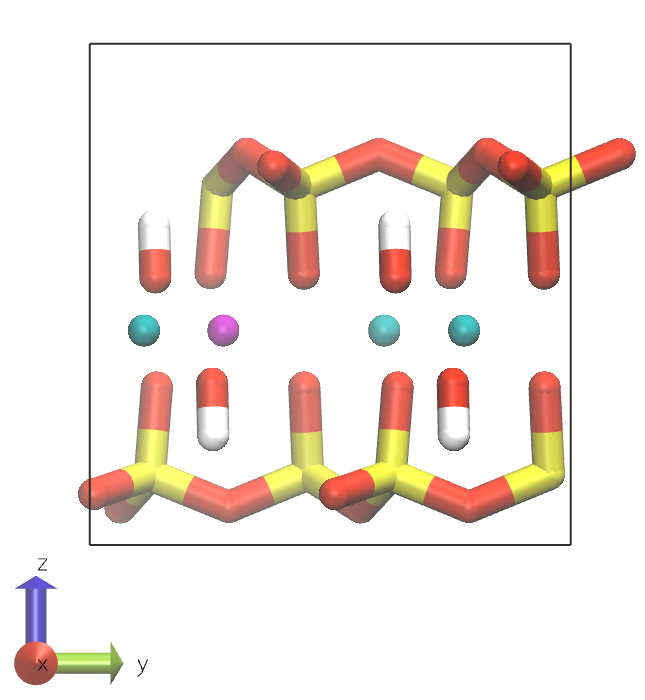
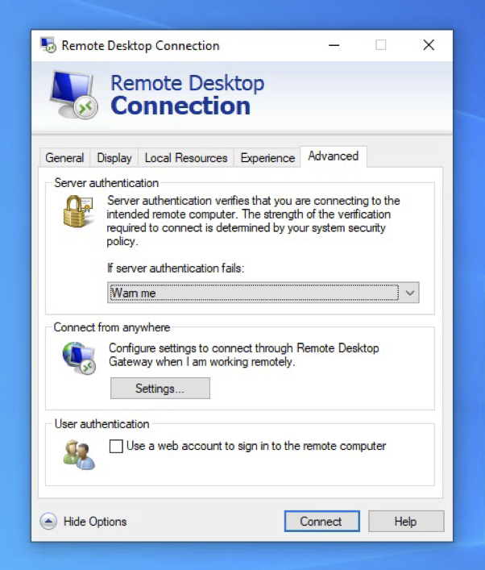
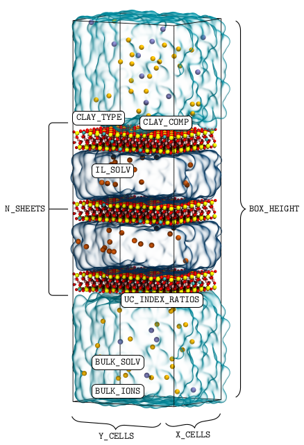
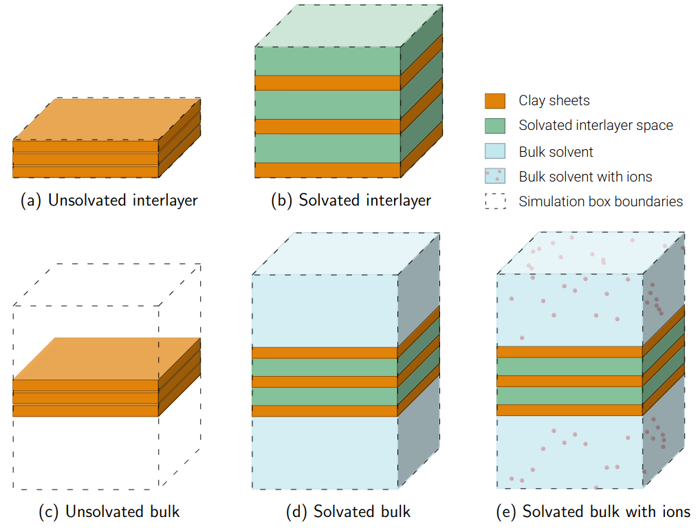
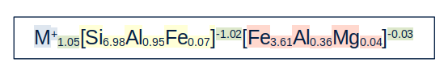

ClayCode Workshop
=================

Contents
--------

- [Introduction](#introduction)
- [Getting Started](#getting-started)
   * [Connecting to the virtual machine](#connecting-to-the-virtual-machine)
   * [Connect to the virtual machine from Windows](#connect-to-the-virtual-machine-from-windows)
   * [Connect to the virtual machine from other machines](#connect-to-the-virtual-machine-from-other-machines)
   * [Installing ClayCode](#installing-claycode-1)
- [Building accurate clay models](#building-accurate-clay-models)
   * [Download the workshop repository](#download-the-workshop-repository)
   * [Prepare the specifications file](#prepare-the-specifications-file)
   * [Preparing a clay model to match a target composition](#preparing-a-clay-model-to-match-a-target-composition)
   * [Prepare the target composition file](#prepare-the-target-composition-file)
   * [Build the clay model](#build-the-clay-model)
   * [Preparing a clay model with UC indices and their ratios](#preparing-a-clay-model-with-uc-indices-and-their-ratios)
   * [Prepare the UC indices and ratios file](#prepare-the-uc-indices-and-ratios-file)
   * [Visualising the clay model](#visualising-the-clay-model)
   * [Visualise the clay model](#visualise-the-clay-model)
- [Inserting molecules into the bulk space](#inserting-molecules-into-the-bulk-space)
   * [Insert decanoic acid molecules](#insert-decanoic-acid-molecules)
   * [Update the topology file](#update-the-topology-file)
   * [Neutralise the system](#neutralise-the-system)
- [Generating simulation input files](#generating-simulation-input-files)
   * [Prepare a simulation input file](#prepare-a-simulation-input-file)
   * [Generate the simulation input files](#generate-the-simulation-input-files)
   * [Perform the energy minimisation](#perform-the-energy-minimisation)
- [What's next?](#whats-next)
- [Suggestions](#suggestions)

Introduction
------------

Creating accurate clay models for classical molecular dynamics (MD) simulations can be a time-consuming and error-prone process. ClayCode is a Python package that can be used to automate this process.

The package is designed with default options to require only minimal user input. At the same time, it is flexible for users to specify their own build directives if they wish to do so.

ClayCode assembles clay sheets from an internal unit cell (UC)
database
containing a selection of different UC types
that have been constructed from crystallographic data from the American Mineralogist Crystal Structure Database
(AMCSD).
A summary of all currently available and future UC types in the ClayCode UC database can be found in [table 1].

 Table 1: Summary of available and future clay and layered double hydroxide (LDH) UC types in the ClayCode UC database with respective with American Mineralogist Crystal Structure Database (AMCSD) IDs.

| UC type | Description | AMCSD code |
| --- | --- | --- |
| TD21 | trans\-dioctahedral 2:1 UC | 0007180 |
| CD21 | cis\-dioctahedral 2:1 UC | 0002868 |
| TD11 | trans\-dioctahedral 1:1 UC | will be added |
| CD11 | cis\-dioctahedral 1:1 UC | 0012237 |
| T21 | trioctahedral 2:1 UC | 0015819 |
| T11 | trioctahedral 2:1 UC | will be added |
| LDH21 | 2:1 LDH UC | will be added |
| LDH31 | 3:1 LDH UC | 0007912 |

A list of all substitutions in the database UCs are given in [table 2].

Table 2: Summary of tetrahedral (T) and octahedral (O) substitutions in database dioctahedral (dio) and trioctahedral (trio) UCs.

| sheet | UC type | substituted atom |     |     | substituting atom |     | charge (e UC\-1) |
| --- | --- | --- | --- | --- | --- | --- | --- |
| T   | dio, trio | Si4+ | (st) | →   | Al3+ | (at) | \-1.0 |
| T   | dio, trio | Si4+ | (st) | →   | Fe3+ | (fet) | \-1.0 |
| O   | dio | Al3+ | (ao) | →   | Fe2+ | (fe2) | \-1.0 |
| O   | dio | Al3+ | (ao) | →   | Fe3+ | (feo) | 0.0 |
| O   | dio | Al3+ | (ao) | →   | Mg2+ | (mgo) | \-1.0 |
| O   | dio | Fe3+ | (feo) | →   | Al2+ | (ao) | 0.0 |
| O   | dio | Fe3+ | (feo) | →   | Fe2+ | (fe2) | \-1.0 |
| O   | dio | Fe3+ | (feo) | →   | Mg2+ | (mgo) | \-1.0 |
| O   | trio | Mg2+ | (mgo) | →   | Li1+ | (lio) | \-1.0 |

The substitutions is the UCs are placed so that any combination of UCs of the same type will yield a sheets where the substitution placement obeys the Loewenstein rule.

[Figure 2] shows an example of a substituted cis\-dioctahedral 2:1 UC.

 

cis\-dioctahedral 2:1 UC top view (left) and side view (right).

Table 3: Atom type colours 

| Element | Colour | empty | Element | Colour |
| --- | --- | --- | --- | --- |
| Si  | yellow | empty | Al  | cyan |
| O   | red | empty | Mg  | purple |
| H   | white | empty | C   | gray |

Getting Started
---------------

#### Installing ClayCode

-   Download ClayCode from the GitHub repository
-   Download ClayCode as a zip file. To do this, go to [https://github.com/Erastova-group/ClayCode.git], click on the "<> Code" button and select "Download ZIP". Once downloaded, extract the contents of the zip file to a location of your choice.
-   Inside the ClayCode folder, there is the `install.sh` installation file. Use it to install the `ClayCode` package:
    
    bash install.sh
    
    > Use `cd ...` to navigate directories in the terminal.
    
    > When doing this on your own computer, make sure all of the [requirements] are installed.
    
-   Once the installation was successful, you can use the package with the command `ClayCode`
    
    > For example, to build a model, the command would be:
    > 
    > ClayCode builder <options>
    

### Connecting to the virtual machine

### Connect to the virtual machine from Windows

1.  Use the ‘Remote Desktop’ application to connect to the virtual machine
2.  Log into the computer
3.  Open Remote Desktop Connection
4.  Click Show Options
5.  Enter the IP address of your virtual machine
6.  Enter username `participant`
7.  Tick the box for Allow me to save credentials
    
    
    
8.  Go to the Advanced tab
9.  Click Settings under Connect from anywhere  
    
    
    
10.  Click Do not use an RD Gateway server and then click OK
    
    
    
11.  Click Connect. If asked whether you trust the computer, tick the box for Don’t ask me again for connections to this computer and click Yes
12.  When prompted to enter credentials, enter the password `cl4ysRock`
    
    
    
13.  You should be logged into the virtual machine
    
    
    
    > IMPORTANT: When you reconnect again, the IP address and your username will be saved, but you need to tick the box for Allow me to save credentials every time. If you forget this, you might not be able to log in.
    

### Connect to the virtual machine from other machines

-   Connect to the virtual machine through the pre-installed Remote Desktop application
-   1.  If using Mac - download **Microsoft Remote Desktop** from the **App Store**.
    2.  If using Linux/Chrome - you should have a preinstalled **Remote Desktop**/**Virtual Machine** app.
-   Follow the instructions above.

### Installing ClayCode

#### Requirements

On this workshop's virtual machine (VM), all of the requirements are already installed. If you would like to use ClayCode on your own computer, the following software and python packages need to be installed.

-   Python 3.10
-   Pipx
-   GROMACS 2018 ‐ 2023
-   MDAnalysis (for d\-spacing equilibration runs)

#### Installation

#### Installing ClayCode

-   Download ClayCode from the GitHub repository
-   Download ClayCode as a zip file. To do this, go to [https://github.com/Erastova-group/ClayCode.git], click on the "<> Code" button and select "Download ZIP". Once downloaded, extract the contents of the zip file to a location of your choice.
-   Inside the ClayCode folder, there is the `install.sh` installation file. Use it to install the `ClayCode` package:
    
    bash install.sh
    
    > Use `cd ...` to navigate directories in the terminal.
    
    > When doing this on your own computer, make sure all of the [requirements] are installed.
    
-   Once the installation was successful, you can use the package with the command `ClayCode`
    
    > For example, to build a model, the command would be:
    > 
    > ClayCode builder <options>
    

Building accurate clay models
-----------------------------

To build a clay model, the following build instructions need to be provided as files:

1.  Specifications on system size, solvation, number of stacked clay sheets, etc. (in YAML format).
2.  Information about the model chemical composition (either as target stoichiometry (in CSV (comma-separated values) format or as individual UC indices and their ratios in the specifications YAML file)

### Download the workshop repository

-   Download the workshop repository from the GitHub repository: [github.com/Erastova-group/ClayCode-workshop]

The following sections contain instructions for using ClayCode to build a clay model by specifying a target stoichiometry and by giving UC indices and their ratios. In both cases, the user needs to provide a specifications file containing the build instructions.  

### Prepare the specifications file

-   Adjust the build specifications for your clay
-   Inside the `builder` folder, you can find a template for the specifications file `specifications.yaml`.
    
    Have a look at the different options in the `specifications.yaml` file, such as the number of clay sheets in the stack or species and concentration of bulk ions.
    
    The required input parameters are:
    
    -   `OUTPUT` : '/path/to/directory'
    -   `CLAY_COMP` : /path/to/file.csv or `UC_INDEX_RATIOS`: {index\_1: index\_1\_ratio, index\_2: index\_2\_ratio}
    -   `SYSNAME` : clay\_name
    -   `CLAY_TYPE` : unit\_cell\_type
    
    Some of the builder options are illustrated in [figure 2].
    
    [Figure 3] shows different sheet and solvent arrangements that can be generated with ClayCode.
    
    
    
    Figure 2: Illustration of the build options in the specification file.
    
    
    
    Illustration of different sheet and solvent arrangements that can be generated with ClayCode.
    

### Preparing a clay model to match a target composition

The first option is to provide a target composition file in CSV format. This file should contain the target composition of the clay model.

For this workshop we suggest setting one of the following Clay Minerals Society source clay compositions ([clays.org/sourceclays\_data/]) as the target:

1.  SWy-1/SWy-2/SWy-3
2.  SAz1/SAz-2
3.  STx-1
4.  NG-1
5.  NAu-1
6.  NAu-2

### Prepare the target composition file

-   Add a new entry for your selected clay.
-   Inside the `builder` folder, you can find a template for the target composition file `target_composition.csv`.
    
    `target_composition.csv` currently only contains the index columns.
    
    Add a new entry for your selected source clay to the file.
    
    As illustrated in [figure 4], the column header identifies the clay type, the entries below describe the average tetrahedral and octahedral UC occupancies, charges and interlayer ion types and ratios.
    
     
    
    Figure 4: Structure of the target composition file CSV file.
    
-   > Notes:
    > 
    > 1.  ClayCode will only include atom tetrahedral and octahedral occupancies that exceed a minimum UC occupancy. Smaller occupancies will be ignored and the missing atoms will be replaced by other atoms types of the same charge.The default value for this is 0.05 atoms UC\-1. The threshold can be adjusted through the `ZERO_THRESHOLD` keyword in the `specifications.yaml` file.
    > 2.  If target occupancies do not sum to the expected tetrahedral or octahedral values but lie within the `OCC_TOL` threshold (default 0.1 atoms UC\-1), the occupancies will be adjusted to match expected values.
    > 3.  If a target composition contains elements without ClayFF parameters and their occupancies exceed `ZERO_THRESHOLD`, ClayCode will ask for confirmation to remove these atoms from the target composition. It will furthermore ask for the charge of the removed atoms. Charges resulting from invalid atom types will be subtracted from the respective UC charges.
    > 4.  The maximum accepted absolute deviation from the specified target composition can be adjusted with the `MATCH_TOLERANCE` parameter. The default value is 0.025 atoms UC\-1.
    > 5.  The `SEL_PRIORITY` and `CHARGE_PRIORITY` specify how adjustments are made in case of incomplete occupancies or mismatches between occupancy and charge and tetrahedral (T) and octahedral (O) charges and total charge.
    >     
    >     The default values are:
    >     
    >     -   `SEL_PRIORITY`: charges ← Charges are preserved and substitution occupancies are adjusted
    >     -   `CHARGE_PRIORITY`: total\_charge ← T and O charges are adjusted and total charge is preserved
    

Once the target composition file is prepared, the clay model can be built using the `ClayCode builder`

### Build the clay model

-   Use ClayCode builder to construct a clay model:
-   ClayCode builder -f /path/to/specifications.yaml
    
-   ClayCode will create a `SYSNAME` directory inside `OUTPATH`. This directory contains the output files that are generated during the build process.
-   The final energy minimised structures are placed inside the EM folder.

### Preparing a clay model with UC indices and their ratios

The second option is to provide UC indices and their ratios in the specifications file. Choose this method if you want to use specific UCs and know their ratios within a sheet.

### Prepare the UC indices and ratios file

-   Specify the target composition through UC indices and ratios
-   Remove the `CLAY_COMP` from the `specifications.yaml` file and instead add the `UC_INDEX_RATIOS` option.
-   When choosing this option, instead of providing the path to the target composition file in the `specifications.yaml` file, delete or comment out the `CLAY_COMP` line and instead add the UC indices and ratios with the `UC_INDEX_RATIOS` option.
    
    > For example, a simplified montmorillonite can be constructed from the cis\-dioctahedral 2:1 C213 UC:
    > 
    > UC\_INDEX\_RATIOS: {C213: 1}
    > 
    > The ratios of the UCs can sum to any number, as the UCs will be normalised to the total number of UCs in the sheet.
    

To build the clay model, follow the same procedure as in [task 4].

### Visualising the clay model

Once the clay model has been built, it can be visualised using VMD.

### Visualise the clay model

1.  Use VMD to visualise the clay model
2.  Open VMD by typing `vmd` in the terminal.
3.  Load the final energy minimised structure into VMD:
    
    > In the main window, click `File` → `New Molecule ...` and select final structure ending in "em.gro" (not "pre\_em.gro") inside the `EM` output folder.
    
    > You can move the molecule around by clicking and dragging the mouse. Press `R` to rotate the molecule (default), `T` to translate it and `S` to scale it. Click on `Display` → `Reset view` to reset the view.
    
4.  Change the representations
    
    > Click on `Graphics` → `Representations` and change `Drawing Method` or `Coloring Method` to see how the molecule representation changes. For the clay, the `Polyhedra` or Licorice representations are good choices.  
    > You can also change the representation of a subset of atoms by selecting them in the `Graphical Representations` window. For this, click on `Create Rep` inside the `Graphical Representations` window. In the `Selected Atoms` field you can replace the `all` by a selection command. E.g. to select all atoms of the residue with the number 10, you can use `resid 10`, for all atoms of the residue with the name `CD2013` use `resname CD2013`, etc. You can find more information about selection commands in the VMD user guide: [www.ks.uiuc.edu/Research/vmd/current/ug/node89.html].
    

Inserting molecules into the bulk space
---------------------------------------

If the clay model was constructed to study adsorption, the next step is to insert molecules into the bulk space.

### Insert decanoic acid molecules

-   Insert 10 decanoic acid molecules into the bulk space of the clay model.
-   Inside the `insert-molecules` folder, you can find the topology and coordinate files for a decanoic acid molecule.
-   Usage of `insert‐molecules`:  
    
    > gmx insert-molecules -f <clay\_coordinate\_input\_file>.gro -ci insert-molecules/decanoic\_acid.gro -nmol <number> -o <clay\_coordinate\_output\_file>.gro
    > 
    > `‐f` specifies the coordinate file of the system to insert into.  
    > `‐ci` specifies the coordinate file of the molecule to insert.  
    > `‐nmol` defines the number of molecules to insert.  
    > `‐o` specifies the output coordinate file name.  
    > 
    > GROMACS will try to fit the requested number of molecules in the available space. It will notify you about whether it was successful or not.
    

Before proceeding to the next step, the topology file needs to be adjusted to include the decanoic acid molecules. that includes all molecules present in the system. The following explains the structure of GROMACS topology files in some more detail.

In the first section, the force field parameters are defined. These always include combination rules and non‐bonded interaction parameters (atom types, atomic masses, atomic charges, Lennard‐Jones parameters). They can optionally include bonded interaction definitions (bond, angle and dihedral types with bond, angle and dihedral interaction force constants and equilibrium values in this order). A detailed explanation can be found in the GROMACS documentation pages: [topology files], [topologies] and [force fields].  

Even if they consist of only one atom, all atoms of the system are part of molecules. These are defined in the second section, `[ moleculetype ]`. All molecule type definitions, such as the MMT UC, decanoic acid, water and ions need to be included in the topology file.

Elements from the first two sections are usually defined in separate files that are included in the topology file. The syntax for including files is `#include "<filename>"`.

The third section contains the system name and the number of molecules of each type in the system. The system section starts with the keyword `[ system ]` and is followed by a name chosen for the system (the choice of the name does not really matter).  
The number of molecules of each type is specified in the `[ molecules ]` section.

_Important:_ The order of the molecules in the `[ molecules ]` section must match the order of the molecules in the `.gro` file.

### Update the topology file

1.  Add the decanoic acid molecules and their force field parameters to the topology file.
2.  Open the topology file topology file ending in `pre_em.top` inside the EM folder and add the 10 inserted DECA molecules at the bottom of the `[ molecules ]` section.  
    
3.  Include the force field parameters for the decanoic acid molecules in the topology file. In this example, the CHARMM36 force field (located inside the `insert-molecules` folder) will be used.  
    Include the bonded and nonbonded force field parameters at the correct positions in the topology file.
    
    > `;` denotes a comment.
    

Since decanoic acid is a charged molecule, the system will need to be neutralised with counterions.

### Neutralise the system

1.  Use GROMACS to neutralise the system with Na+ ions:
2.  Generate a run TPR file for the system :
    
    Because neutralising requires information about the system topology, adding ions with `genion` requires a compiled topology file. Use `grompp` to generate such a `TPR` file. The contents of the run parameter `MDP` input file is not important for this step, but it has to be provided.  
    Use the `genion.mdp` parameter file from the `insert-molecules/MDP` folder.
    
    Usage of `grompp`:
    
    > gmx grompp ‐f MDP/genion.mdp ‐c <clay\_coordinate\_file>.gro ‐p <clay\_topology\_input\_file>.gro ‐o <compiled\_topology\_output\_file>.gro ‐pp <clay\_topology\_output\_file>.gro ‐maxwarn 1
    > 
    > `‐f` specifies the input run parameter file.  
    > `‐c` specifies the coordinate file of the system to solvate.  
    > `‐p` specifies the topology file.  
    > `‐o` specifies the compiled output `.tpr` file.  
    > `‐pp` specifies the output topology file.  
    > `‐maxwarn` specifies the maximum number of warnings that can be ignored. If the protein has a charge, `grompp` will generate a warning that needs to be ignored.  
    > 
    > The `‐pp` has to be used here to generate a new topology file with ions is used here rather than with the `genion` command.
    
    `grompp` will generate a note similar to this one:
    
    NOTE 3 \[file MMT\_dec\_solv.top, line 40\]:
    In moleculetype 'MMT' 32 atoms are not bound by a potential or constraint
    to any other atom in the same moleculetype. Although technically this
    might not cause issues in a simulation, this often means that the user
    forgot to add a bond/potential/constraint or put multiple molecules in
    the same moleculetype definition by mistake. Run with `‐v` to get
    information for each atom.
    
    This note is not an error, but a warning that the atoms in the clay sheet are not bonded to each other. Because ClayFF is a non‐bonded force field, this is not an error, and you can ignore this message.
    
3.  Use GROMACS `genion` to neutralise the system with Na+ ions:
    
    Usage of `genion`:
    
    > gmx genion ‐s <compiled\_topology\_file>.gro ‐o <clay\_coordinate\_output\_file>.gro ‐p <clay\_topology\_input\_file>.gro ‐pname Na ‐nname Cl ‐neutral
    > 
    > `‐s` specifies the input coordinate file of the system to solvate.  
    > `‐o` specifies the output coordinate file  
    > `‐p` specifies the input topology file  
    > `‐pname` specifies the name of the positive ion  
    > `‐nname` specifies the name of the negative ion  
    > `‐neutral` – neutralise the system  
    > 
    > You will be asked which molecules should be replaced with ions. Select the code for the bulk water `SOL` molecules.
    

Generating simulation input files
---------------------------------

ClayCode can be used to generate simulation input files for GROMACS. Default run options are available for GROMACS versions 2018-2023 and the following run types:

-   Energy minimisation (EM)
-   Equilibration (EQ)

-   without temperature or pressure coupling
-   with temperature coupling at constant volume (NVT)
-   with pressure coupling at constant temperature and pressure (NpT)

-   d\-spacing equilibration (D\_SPACE)
-   Production (any other name)

Like the build instructions, the simulation input file is generated from a YAML file containing the simulation run parameters.

Since time is short, use ClayCode siminp to generate the simulation input files and scripts for an energy minimisation.

### Prepare a simulation input file

-   Prepare a simulation input file for an energy minimisation run
-   Inside the `builder` folder, you can find a template for the simulation input file `simulation.yaml`.
-   > Notes:
    > 
    > -   You can specify a run type and generate a mdp file with ClayCode's default parameters or supply your on mdp files
    > -   When adding new MDP parameters, these can be added as the default parameters for all runs, as defaults for one run type or ensemble or specifically for one run
    > -   For d\-space equilibration runs, a conda environment and shell can be specified
    > -   The run script can be customised by specifying a shell or providing a header template.
    

Now the energy minimisation files can be prepared.

### Generate the simulation input files

-   Use ClayCode to generate the simulation input files and scripts for an energy minimisation run:
-   ClayCode siminp -f /path/to/simulation.yaml
    
-   This will generate a folder with all required files for the energy minimisation run and place it in the specified output folder.

Once the simulation input files are generated, the energy minimisation can be performed.

### Perform the energy minimisation

-   Run the energy minimisation run script
-   bash <run\_script>.sh
    

What's next?
------------

ClayCode already contains a small range of clay-system specific analysis and plotting scripts. These are not yet available as part of the ClayCode application but can be used when ClayCode is installed as a package (using pip rather than pipx).

We are planning to add some more UCs will be added ([table 1]). In the current version, ClayCode data can be used to add a new unit cell type by supplying coordinates and the topology of one unsubstituted unit cell. In this procedure, it is possible to specify which and how many substitutions should be added.

Suggestions
-----------

We would love you to get involved in the development of ClayCode!

-   Is something not working as expected?
-   Which features would you like to see in future versions of ClayCode?
-   Are you interested in contributing to the development of ClayCode?

Let us know now or use the discussion board, raise an issue, or submit a pull request on the GitHub repository.

Thank you for your participation!

[table 1]: #tab:ucs
[table 2]: #tab:subs
[Figure 2]: #fig:ucs
[https://github.com/Erastova-group/ClayCode.git]: https://github.com/Erastova-group/ClayCode.git
[requirements]: #toc_2_1
[https://github.com/Erastova-group/ClayCode.git]: https://github.com/Erastova-group/ClayCode.git
[requirements]: #toc_2_1
[github.com/Erastova-group/ClayCode-workshop]: https://github.com/Erastova-group/ClayCode-workshop
[figure 2]: #fig:build_options
[Figure 3]: #fig:stackings
[clays.org/sourceclays\_data/]: https://www.clays.org/sourceclays_data/
[figure 4]: #fig:formula
[task 4]: #task_4
[www.ks.uiuc.edu/Research/vmd/current/ug/node89.html]: https://www.ks.uiuc.edu/Research/vmd/current/ug/node89.html
[topology files]: https://manual.gromacs.org/current/reference-manual/topologies/topology-file-formats.html#topfile
[topologies]: https://manual.gromacs.org/current/reference-manual/topologies/topologies.html
[force fields]: https://manual.gromacs.org/current/reference-manual/functions/functions.html#ff
